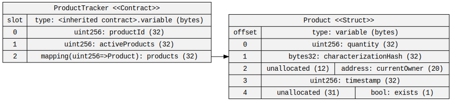
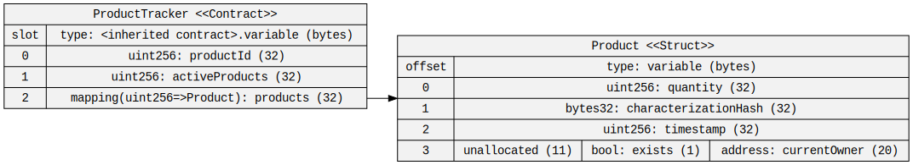
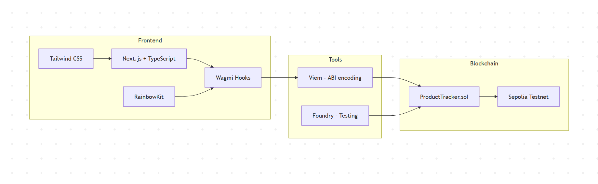
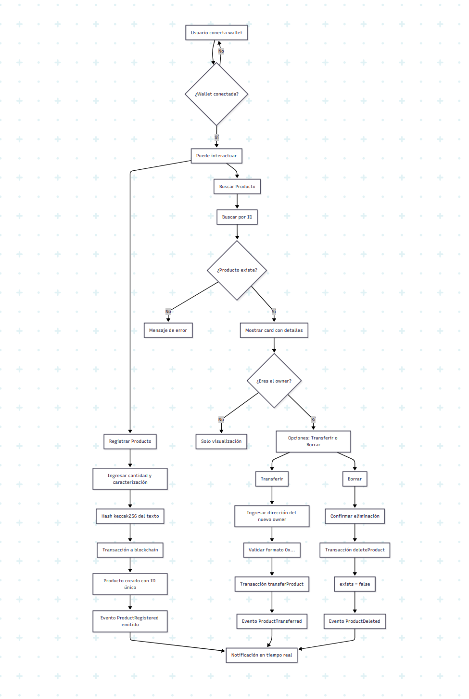
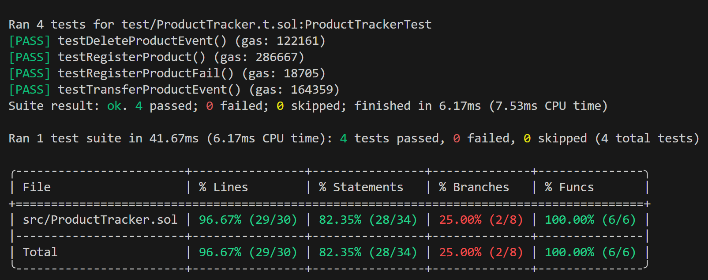
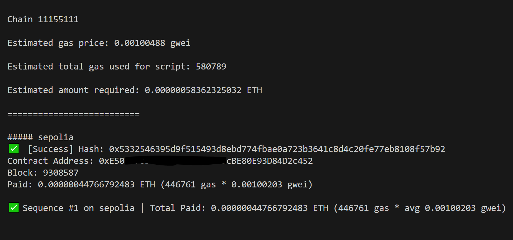
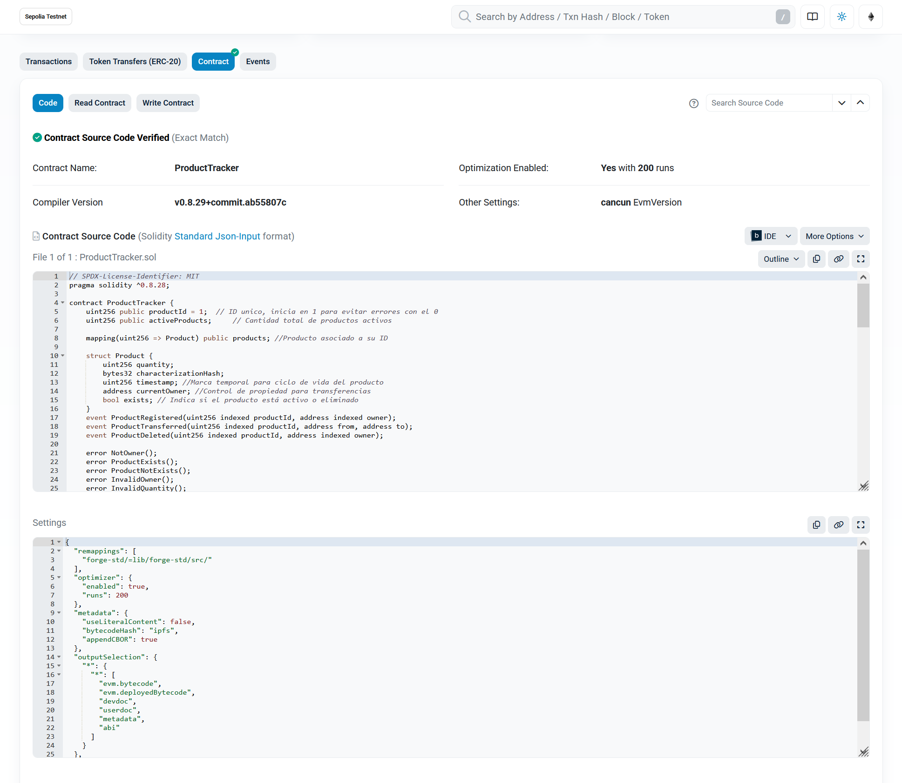
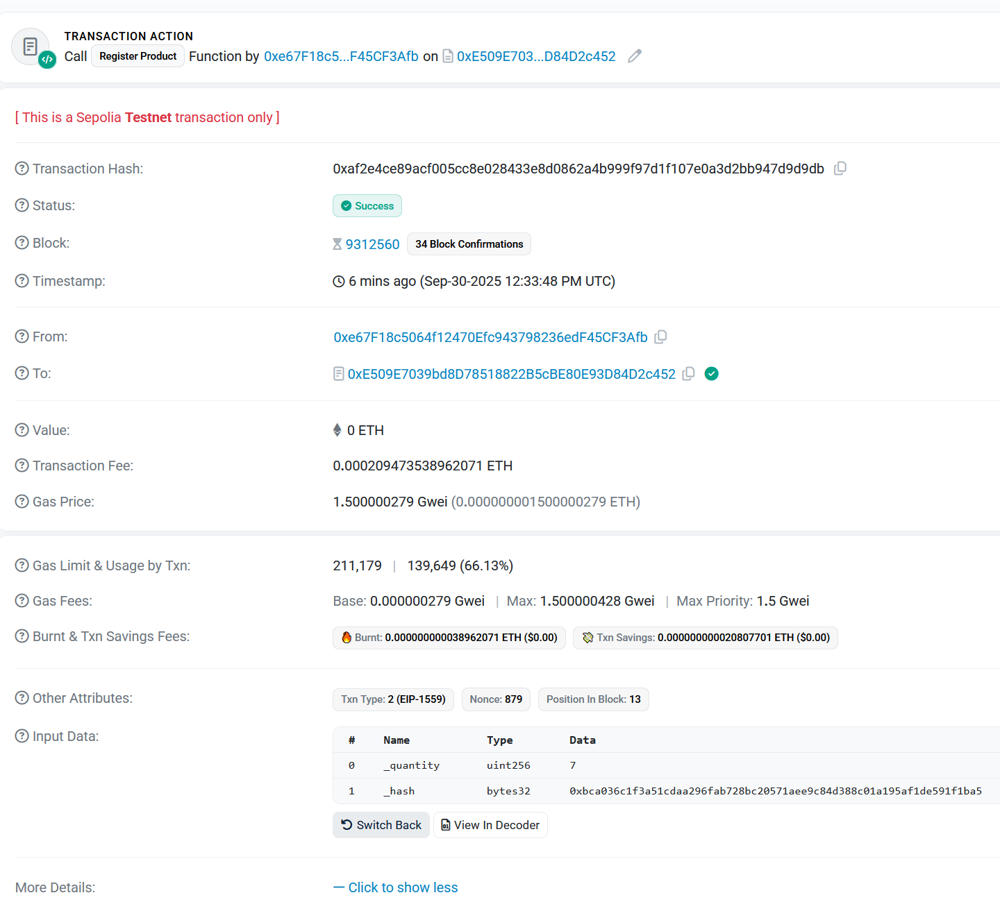
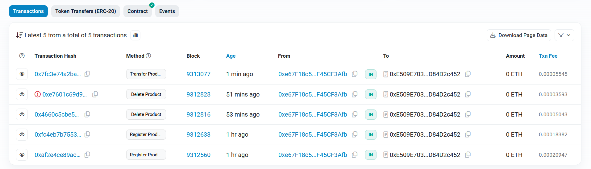

# Product Traceability DApp

Aplicación descentralizada para trazabilidad de productos en blockchain.

##  Decisiones de Diseño y Alcance

### Ciclo de vida completo
Aunque los requisitos mencionaban "seguimiento de eventos a lo largo del ciclo de vida", no especificaban qué funcionalidades debían implementarse. Para asegurar una cobertura completa, implementé el ciclo de vida completo:
- **Registro** de productos
- **Transferencia** de propiedad entre addresses (cuentas)
- **Eliminación** lógica (soft delete)

### Testing exhaustivo
Los requisitos pedían cobertura de "registro de productos" y "registro de eventos". Para una cobertura más robusta, incluí:
- Tests de la función de registro de productos (happy paths)
- Tests de casos de error en registro de productos (reverts)
- Simple validación de eventos para las tres operaciones

**Nota:** Soy consciente de que se podría mejorar mucho el test, pero consideré que para esta prueba técnica el alcance actual demuestra capacidad de testing sin excederse en tiempo de desarrollo.

### Optimización de gas
Durante el desarrollo, optimicé el storage layout del struct `Product`, reduciendo de 5 a 4 slots de almacenamiento mediante reordenamiento de variables:

**Antes (5 slots):**

**Después (4 slots):**

Esta optimización reduce el costo de gas, aunque en este caso concreto la diferencia no es significativa.

## ⚠️ Alcance y limitaciones conocidas

### Frontend funcional, no pulido
La interfaz está diseñada para **demostrar funcionalidad**, no para producción. Algunos aspectos pendientes de mejora:
- **UX/UI:** Diseño básico sin cuidado visual y usabilidad mejorable (por ejemplo no hay indicador de red correcta (Sepolia))
- **Manejo de errores:** Algunos casos no están cubiertos (por ejemplo los inputs de los modales no se limpian al cerrar/reabrir)
- **Validaciones:** Podrían ser más exhaustivas en inputs (por ejemplo, los campos numéricos aceptan decimales o letras)
- **Feedback al usuario:** Estados de carga y errores podrían ser más informativos
- **Responsive design:** No está optimizado para móvil

En un proyecto real, estos aspectos requerirían iteraciones adicionales de UX, testing de usuario, y refinamiento.

### Smart contract - Enfoque pragmático
El contrato prioriza claridad y cumplimiento de requisitos. Mejoras potenciales en un proyecto real:
- **Roles:** Implementar access control si hubiera múltiples actores (fabricantes, distribuidores, retailers)
- **Metadata:** URI para información adicional del producto (imágenes, certificaciones)
- **Batch operations:** Registrar múltiples productos en una transacción

Para esta prueba técnica, el contrato cubre los requisitos fundamentales sin añadir complejidad innecesaria.

## Características

- Registro de productos con hash de caracterización
- Transferencia de propiedad entre addresses
- Sistema de eliminación lógica (soft delete)
- Notificaciones en tiempo real de eventos
- Interfaz responsiva con RainbowKit

### Frontend con eventos en tiempo real
Aunque no estaba explícitamente requerido, implementé:
- Escucha de eventos del contrato (`ProductRegistered`, `ProductTransferred`, `ProductDeleted`)
- Notificaciones en tiempo real en la UI
- Sistema de búsqueda con card de producto

## Arquitectura

## Stack Tecnológico

- **Frontend**: Next.js 15 + TypeScript + Tailwind CSS
- **Blockchain**: Solidity ^0.8.20 + Foundry
- **Web3**: viem + wagmi + rainbowkit
- **Estilos**: Tailwind CSS
- **Testing**: Forge (Foundry)

## Flujo de Usuario

## Testing

## Despliegue

### Se despliega en Sepolia

### Se verifica en Etherscan

#### Contrato desplegado en Sepolia

Address: 0xE509E7039bd8D78518822B5cBE80E93D84D2c452

- [Ver en Etherscan](https://sepolia.etherscan.io/address/0xE509E7039bd8D78518822B5cBE80E93D84D2c452)

#### Transacciones de ejemplo:

- [Registro de producto](https://sepolia.etherscan.io/tx/0xfc4eb7b755387a268dec099002cc1ad06bb682132774c5d653dabf278a0a0390)
- [Transferencia](https://sepolia.etherscan.io/tx/0x7fc3e74a2ba26c90c59d1a6ccc4665849ce8922a96eb5709068c9955a76f214e)
- [Eliminación](https://sepolia.etherscan.io/tx/0x4660c5cbe584791efad71d628521974ba7228d7fd6e60e12489c42daa6d399b0)

📦 Instalación
# Clonar repo
git clone https://github.com/Juan-Fuente-T/prueba-trazabilidad-producto.git

# Instalar dependencias
npm install

# Compilar contratos
forge build

# Ejecutar tests
forge test

# Iniciar frontend
npm run dev

🔐 Variables de Entorno

- NEXT_PUBLIC_WALLETCONNECT_PROJECT_ID=...
- NEXT_PUBLIC_WEB3AUTH_CLIENT_ID=...
- NEXT_PUBLIC_SEPOLIA_RPC_URL_SEPOLIA_RPC_URL=...
- PRIVATE_KEY=...
- ETHERSCAN_API_KEY=...
- NEXT_PUBLIC_API_URL=
- NEXT_PUBLIC_PARTICIPANTE_MAYORISTA=
- NEXT_PUBLIC_PARTICIPANTE_TRANSPORTISTA=
- NEXT_PUBLIC_PARTICIPANTE_PUNTOVENTA