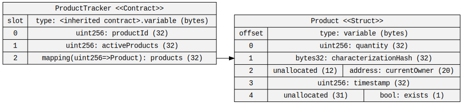
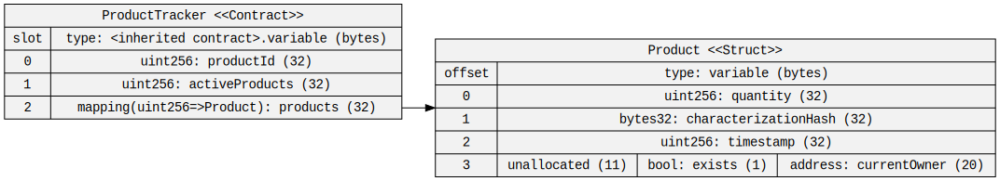
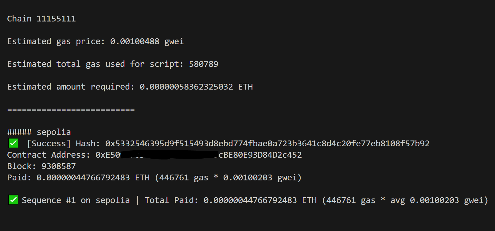
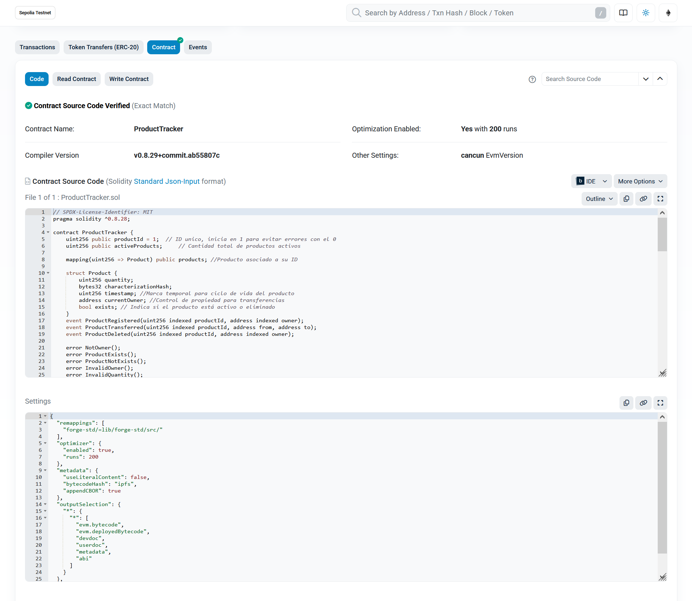

# Product Traceability DApp

Aplicación descentralizada para trazabilidad de productos usando blockchain.

## Stack Tecnológico

- **Frontend**: Next.js 15 + TypeScript + Tailwind CSS
- **Blockchain**: Solidity + Foundry
- **Web3**: viem + wagmi
- **Testing**: Forge (Foundry)

### Se optimiza la memoria para mejorar el rendimiento y el coste

#### Primera comprobación. La dirección del owner(slot 24 del struct) y el booleano(slot 4) estan ocupando slots imcompletos.



#### Segunda comprobación. La dirección del owner y el booleano ahora ocupan un solo slot(slot 3).



## Despliegue

#### Se ha deplegado en Sepolia



#### Se ha verificado en Etherscan



## Instalación
```bash
# Instalar dependencias
npm install

# Inicializar Foundry (si no lo has hecho)
forge init --force